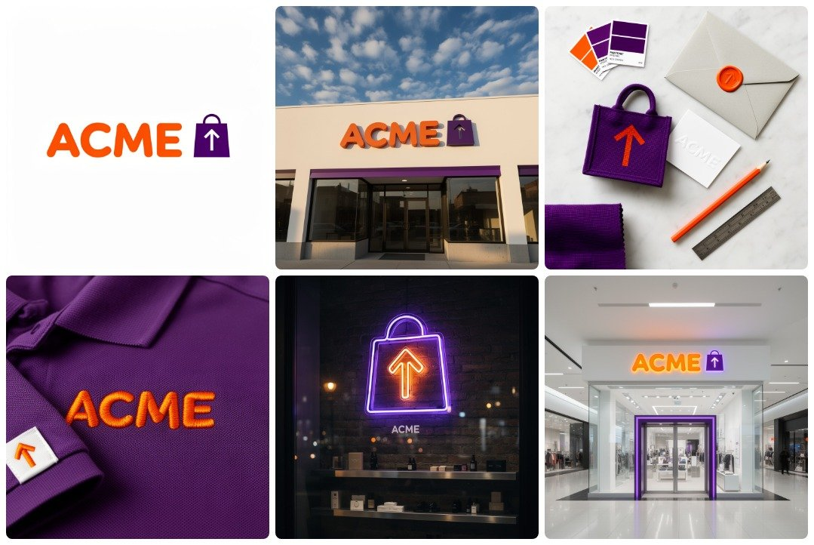
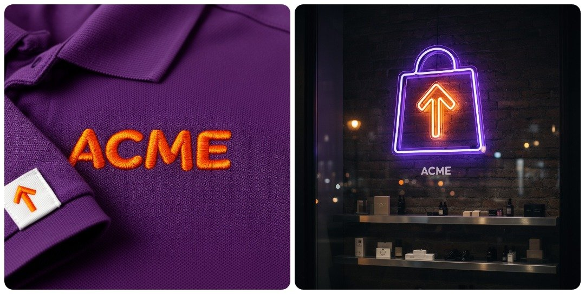
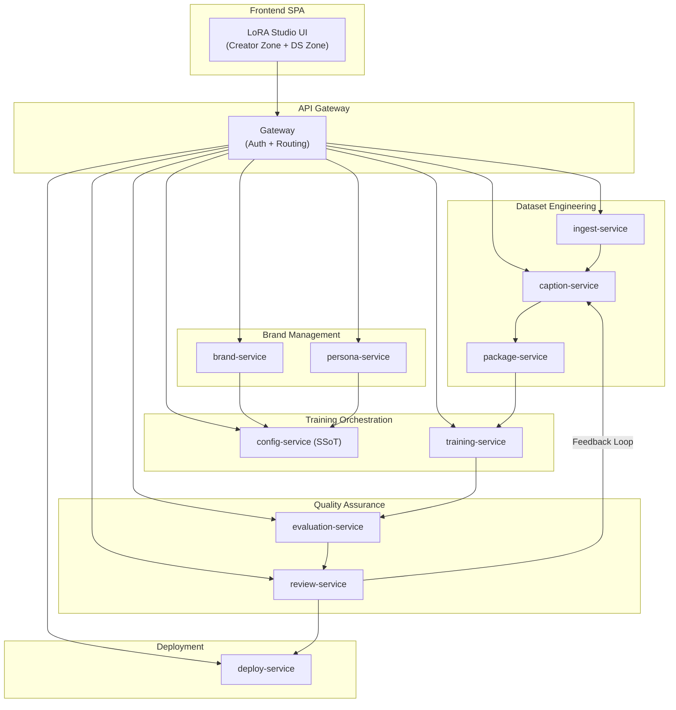
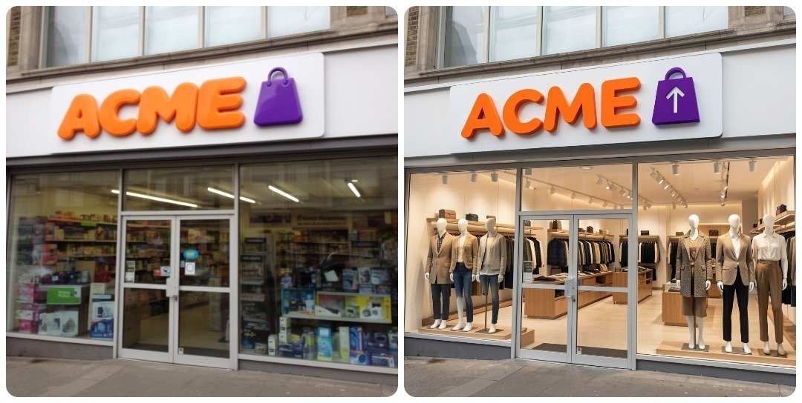

# LoRA Studio: Architecture Case Study — AI-Powered Brand Consistency at Scale

> **This is an architecture case study — documentation of a production-grade system, not runnable software.** Licensed under [CC-BY-4.0](LICENSE). Based on a real enterprise brand production system. Client details are anonymized.

---

## What Is This?

This repository documents the complete architecture of **LoRA Studio** — a SaaS platform that transforms brand guidelines into trained LoRA models for AI image generation with mathematically enforced visual consistency. The system orchestrates a 10-stage pipeline across **15 microservices** to serve two personas: Marketing Creators (zero ML jargon) and Data Scientists (full parameter control).

The core technical innovation is the **LOCKED/UNLOCKED Protocol** — a deterministic method derived from the Flow Matching loss function that encodes brand identity directly into model weights, making brand drift structurally impossible rather than manually policed.

**This case study is the architecture behind the concepts described in my LinkedIn articles:**
- [How I Built an AI System That Turns Brand Guidelines Into 10,000 On-Brand Assets](https://www.linkedin.com/in/vandresales/) (Business perspective)
- [The Mathematics of Brand Memory: How Loss Functions Enforce Visual Identity](https://www.linkedin.com/in/vandresales/) (Technical perspective)

---

## The Problem

Every enterprise with a recognizable brand faces a silent tax: **scaling visual consistency across channels without scaling headcount.**

- A single major campaign costs **$15K–40K** when accounting for designer hours, review cycles, and rework from brand violations
- **60–75% of design team time** goes to mechanical variations — not creative work
- Brand identity lives in a PDF that no system can enforce — the enforcement mechanism is a human reviewing every asset, every time

The challenge intensifies across physical substrates — embroidered fabric, backlit acrylic, neon tubing, 3D signage — where each material deforms brand geometry in fundamentally different ways that most AI systems ignore entirely.

---

## Architecture Overview

**15 microservices** organized into 5 bounded contexts (DDD), communicating exclusively via REST API. Each service owns its database — zero shared state. The pipeline includes **3 human gates** where automated processing pauses for expert review.

→ [**Deep dive: Full Architecture**](paper/03-ARCHITECTURE.md)

---

## The Core Insight: Brand Memory Through Omission

The loss function in Flow Matching models:

$$L = \|v - v_\theta(x_t, t, c_{text})\|^2$$

has a profound architectural implication: **when a visual attribute is present in the training image but absent from the caption**, the model encodes it directly into the LoRA weights — permanently bound to the trigger word. This is not a heuristic; it is a deterministic effect of the mathematics.

- **LOCKED attributes** (logo geometry, typography): Never captioned → encoded in weights → permanent, unconditional
- **UNLOCKED attributes** (background, lighting): Always captioned → text-conditioned → flexible at inference

→ [**Deep dive: Mathematical Methodology**](paper/02-METHODOLOGY.md)

---

## Business Impact (Projected)

| Metric | Before | After | Improvement |
|---|---|---|---|
| **Production Time** | 6–8 weeks per campaign | Days | **85% reduction** |
| **Production Cost** | $15K–40K per campaign | Fraction | **70% reduction** |
| **Brand Compliance** | Manual review (human error) | Mathematical enforcement | **100% structural** |

→ [**Deep dive: Evaluation & Business ROI**](paper/04-EVALUATION.md)

---

## Cloud Infrastructure

The system runs on **NVIDIA GPUs** (A100/H100/RTX PRO 6000) accessed via **AWS EC2** instances. ComfyUI and Flux models are used in alignment with the **NVIDIA Inception** program. The architecture is cloud-agnostic — AWS is documented as the canonical reference with GCP and Azure equivalents mapped for each service.

| Layer | AWS (Canonical) | GCP (Equivalent) | Azure (Equivalent) |
|---|---|---|---|
| GPU Compute | EC2 G7E / P5 | Compute Engine A3 | NC A100 v4 / ND H100 v5 |
| Container Orchestration | ECS Express Fargate | Cloud Run | Container Apps |
| ML Platform | SageMaker | Vertex AI | Azure ML |
| Object Storage | S3 | Cloud Storage | Blob Storage |

→ [**Deep dive: Architecture (Cloud Layer)**](paper/03-ARCHITECTURE.md)

---

## Evidence of Implementation

This case study is based on a real production system. Evidence of implementation:

- **[MLV_Nodes_V3](https://github.com/vandre-sales/MLV_Nodes_V3)** — Open-source ComfyUI custom nodes (V3 API) used in the production pipeline: LoRA Stack, Ollama LLM, Dict Lookup, JSON Batcher
- **[OKLCH-Spectrum-Audit](https://github.com/vandre-sales/OKLCH-Spectrum-Audit)** — Advanced OKLCH color palette visualizer demonstrating color science expertise
- **[Alpha-Compose](https://github.com/vandre-sales/Alpha-Compose)** — Professional image composition tool with 4K exports
- **10 public repositories** + 37 private repositories covering the full ML pipeline stack

### Recognition & Credentials

| Recognition | Source | Year |
|---|---|---|
| 🏆 **Top 10 Prêmio Sebrae Startups** (Winner: Media, Marketing & Advertising) | [Agência Sebrae](https://agenciasebrae.com.br/inovacao-e-tecnologia/sebrae-revela-as-10-startups-mais-promissoras-do-brasil-em-2025/) | 2025 |
| ☁️ **AWS Case Study** (via Select Soluções — AWS Partner) | [Select Soluções](https://selectsolucoes.com.br/case/meliva-ai/) | 2025 |
| 🧠 **GenAI Producer** (ACE Ventures + AWS classification) | [Future Dojo](https://www.futuredojo.com.br/blog/o-que-sao-producers-de-genai-e-por-que-eles-vao-definir-o-futuro-da-inteligencia-artificial-no-brasil-u456x) | 2025 |
| 🏅 **GenAI Awards 2024** — Transformative Use Cases in AI | Industry award | 2024 |
| 🌐 **Web Summit Lisboa 2023 + Rio 2024** | International participation | 2023–24 |

---

## Go Deeper

| Section | What You'll Find | Time |
|---|---|---|
| [**paper/01-PROBLEM.md**](paper/01-PROBLEM.md) | The brand consistency gap, substrate challenge, market data | 5 min |
| [**paper/02-METHODOLOGY.md**](paper/02-METHODOLOGY.md) | Loss function math, LOCKED/UNLOCKED protocol, captioning pipeline | 10 min |
| [**paper/03-ARCHITECTURE.md**](paper/03-ARCHITECTURE.md) | 15 microservices, DDD, REST contracts, cloud infrastructure | 15 min |
| [**paper/04-EVALUATION.md**](paper/04-EVALUATION.md) | 4 automated metrics, human gates, business ROI | 5 min |
| [**paper/05-RELATED-WORK.md**](paper/05-RELATED-WORK.md) | Stability AI, Replicate, NVIDIA ecosystem, Brazilian GenAI landscape | 8 min |
| [**services/**](services/) | OpenAPI specs, SQL schemas, READMEs for 5 core services | 20 min |
| [**examples/**](examples/) | UX flows for Creator onboarding, DS training monitor, review gallery | 10 min |
| [**GLOSSARY.md**](GLOSSARY.md) | 28+ ML terms explained for non-ML developers | 3 min |

---

## About the Author

**Vandré Sales** — AI/ML Architect specializing in multi-agent systems and generative AI for brand production. AWS CTO Fellowship alumni. Computer Engineering (UFG) + Physics (Unicamp).

- [LinkedIn](https://www.linkedin.com/in/vandresales/) · [GitHub](https://github.com/vandre-sales)

---

## License

This work is licensed under [Creative Commons Attribution 4.0 International (CC-BY-4.0)](LICENSE). This is an architecture case study (documentation and diagrams), not runnable software. You are free to share and adapt with attribution.
