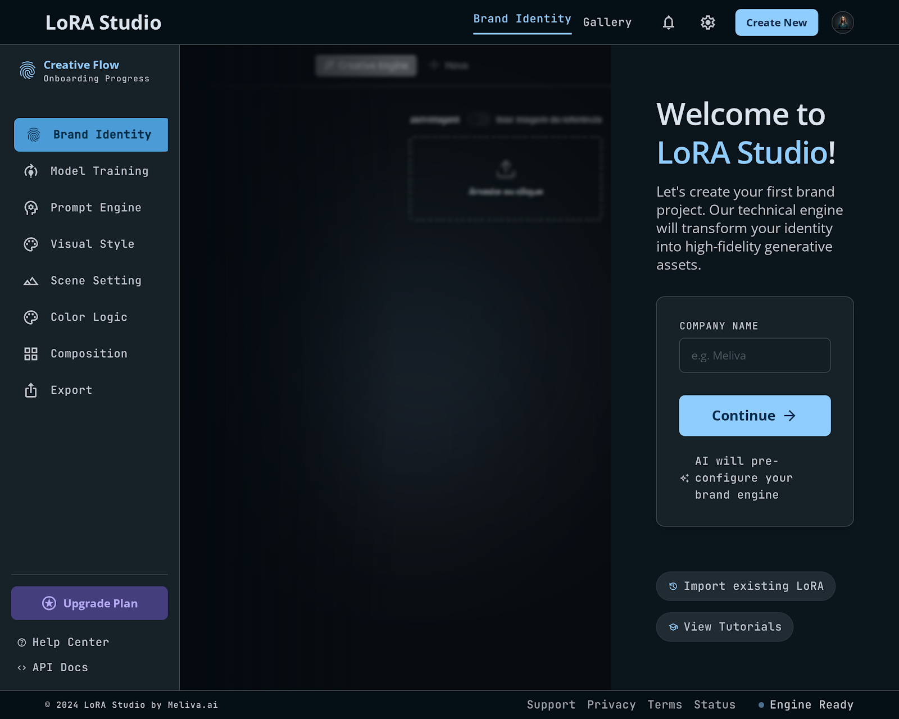
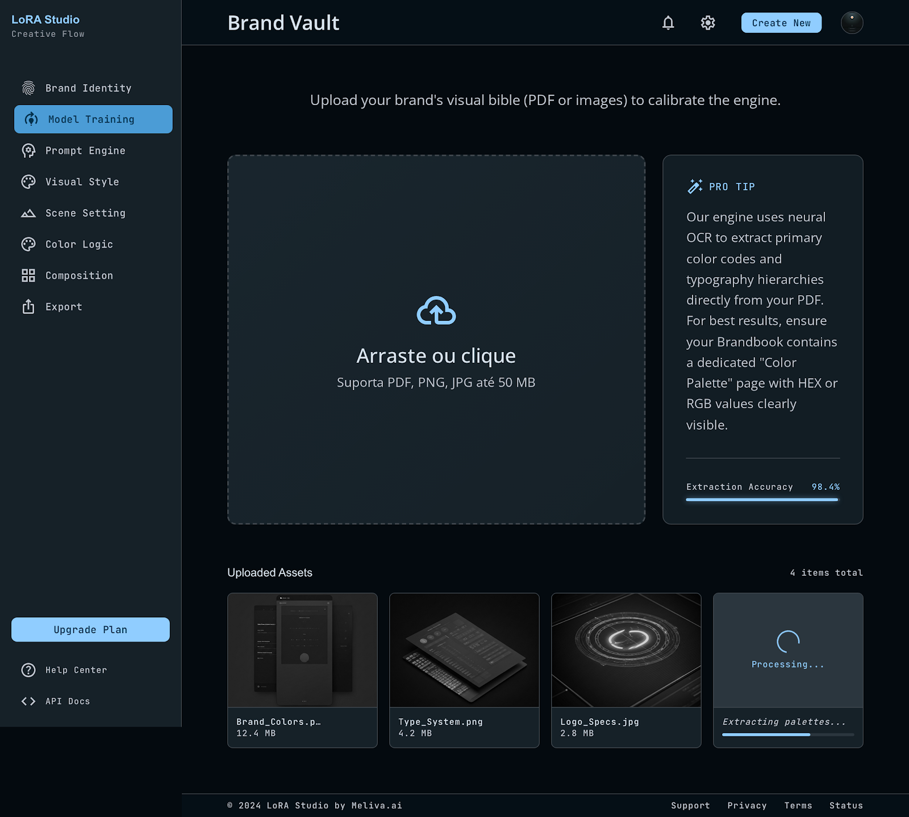
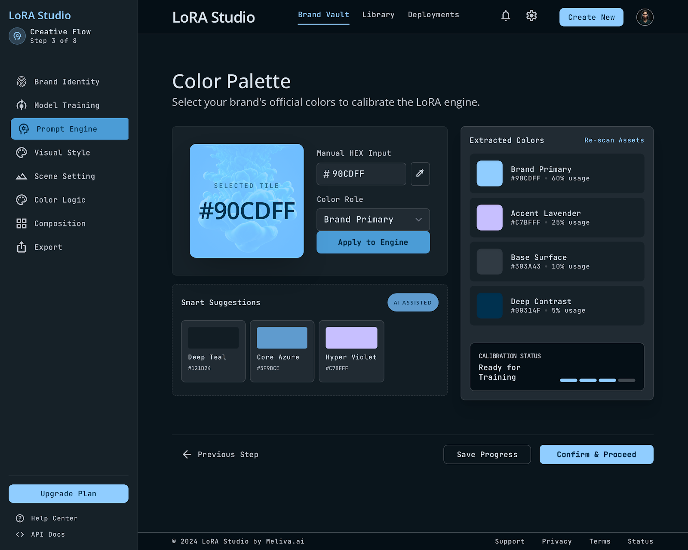
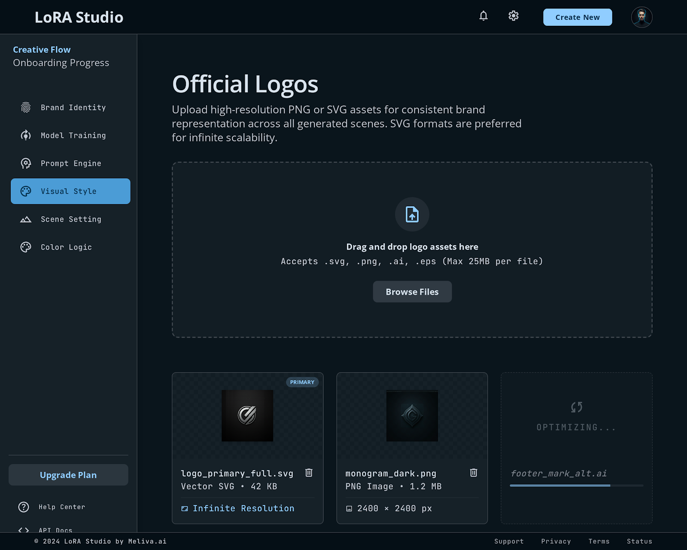
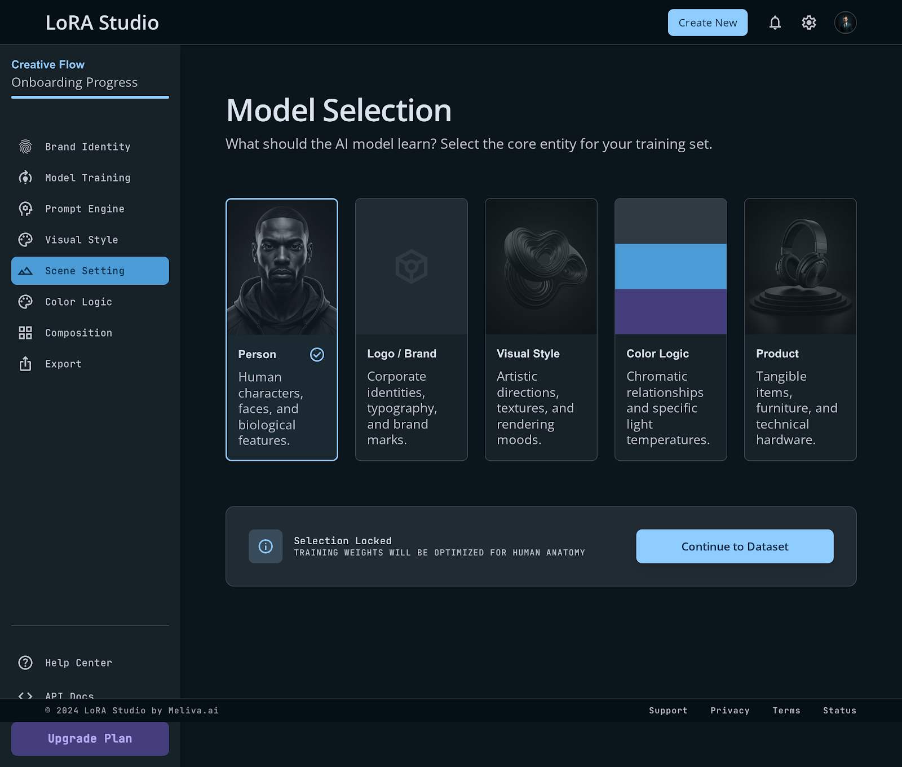
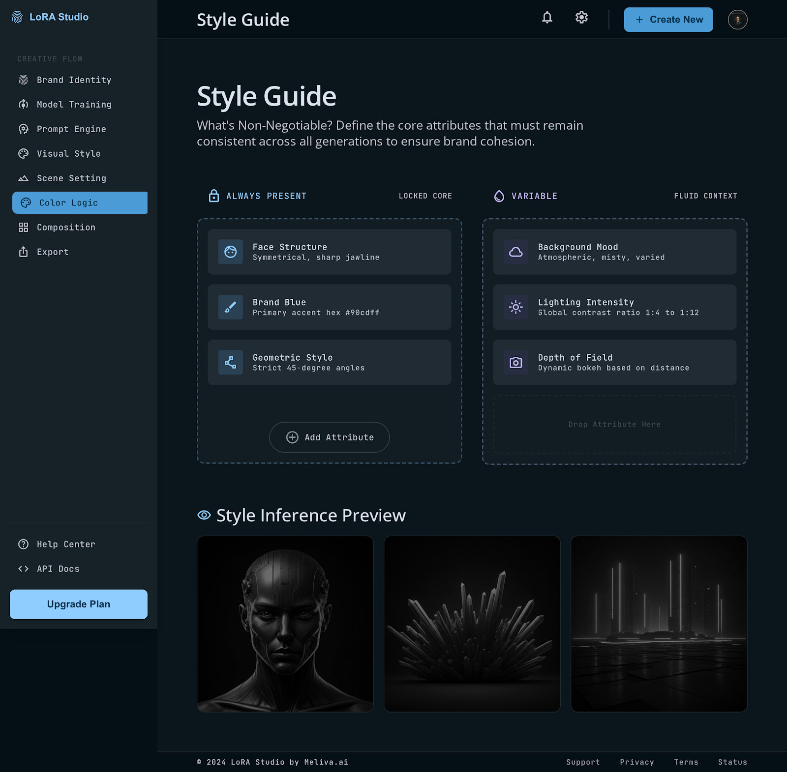
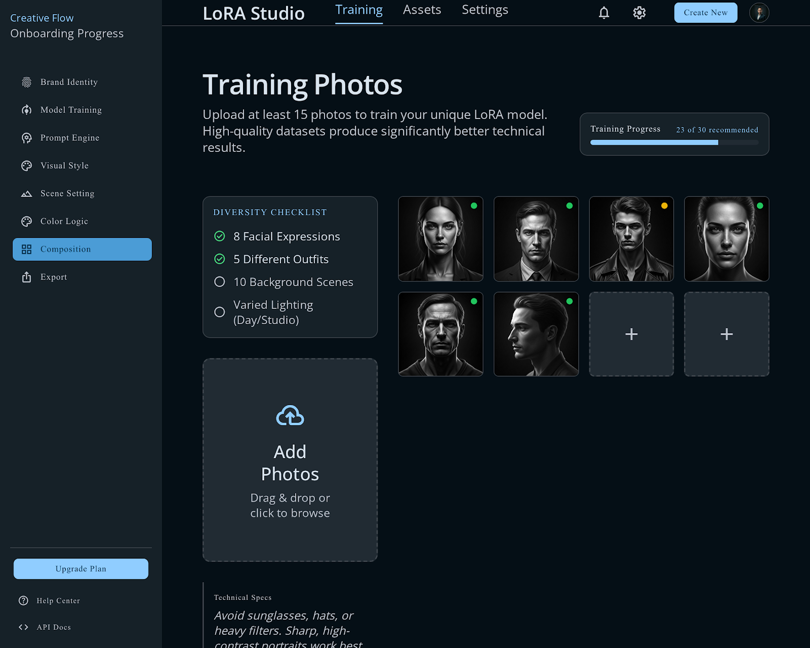
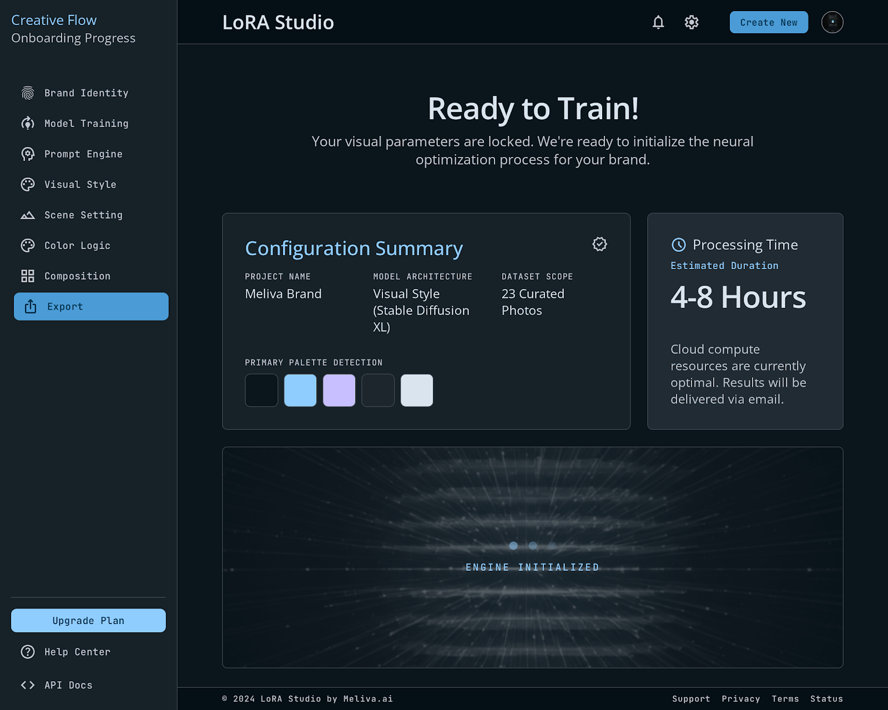

# Creator Journey — Onboarding Flow (8 Screens)

This document walks through the complete Creator experience from first login to "your model is training."

> **⚠️ Disclaimer:** The screenshots shown below are non-functional mockups. Original production interface screenshots have been replaced with mockups for client governance and privacy reasons.

## Screen 1: Welcome
> "Welcome to LoRA Studio! Let's create your first brand project."

- Input: Company name
- Action: `POST /api/v1/projects`

## Screen 2: Brand Vault — Brandbook Upload
> "Upload your brand's visual bible (PDF or images)"

- Drag-drop zone (max 50 MB, PDF/PNG/JPG)
- Preview thumbnails of uploaded assets
- Action: Presigned upload → `POST /api/v1/brands`

## Screen 3: Brand Vault — Color Palette
> "Select your brand's official colors"

- Color picker with HEX input
- Auto-detect: extracts colors from uploaded PDF via Vision AI
- Each color: HEX + descriptive name + usage percentage
- Action: `POST /api/v1/brands/{id}/palette`

## Screen 4: Brand Vault — Official Logos
> "Upload your official logos (PNG or SVG)"

- Multi-file drag-drop with resolution indicators
- Action: `POST /api/v1/brands/{id}/logos`

## Screen 5: Model Type Selection
> "What should the AI model learn?"

- Visual cards: Person/Character | Logo/Brand | Visual Style | Color Palette | Product/Object
- Selection determines LoRA type for config-service

## Screen 6: Style Guide — "What's Non-Negotiable?"
> Two-column drag-and-drop interface:

- **Left column:** "Always Present" (LOCKED)
- **Right column:** "Can Change Between Images" (UNLOCKED)
- Pre-populated based on type (e.g., persona pre-locks face, hair, age)
- Creator can drag attributes between columns and add custom ones
- Action: `POST /api/v1/brands/{id}/style-guide` → auto-triggers config-service

## Screen 7: Asset Upload — Training Photos
> "Upload at least 15 photos"

- Counter: "23 of 30 recommended"
- Quality indicators: green (passed), yellow (will resize), red (rejected)
- Diversity checklist: 5+ expressions, 10+ outfits, 5+ scenes, 3+ lighting, 3+ compositions
- Action: `POST /api/v1/datasets/{id}/images` → auto-resize + validate

## Screen 8: Confirmation & Handoff
> "Your project is ready for processing!"

- Visual summary: brand name, type, photo count, locked attributes list
- Estimated timeline: "4–8 hours until review"
- Button: "Start Processing" → backbone initiates full pipeline
- Creator receives notification when model is ready for visual review (Gate 3)

---

**Key UX principle:** Zero ML jargon on any screen. Terms like "rank," "alpha," "loss," "trigger," "LoRA" never appear in the Creator Zone.

*← Back to [README](../README.md)*
