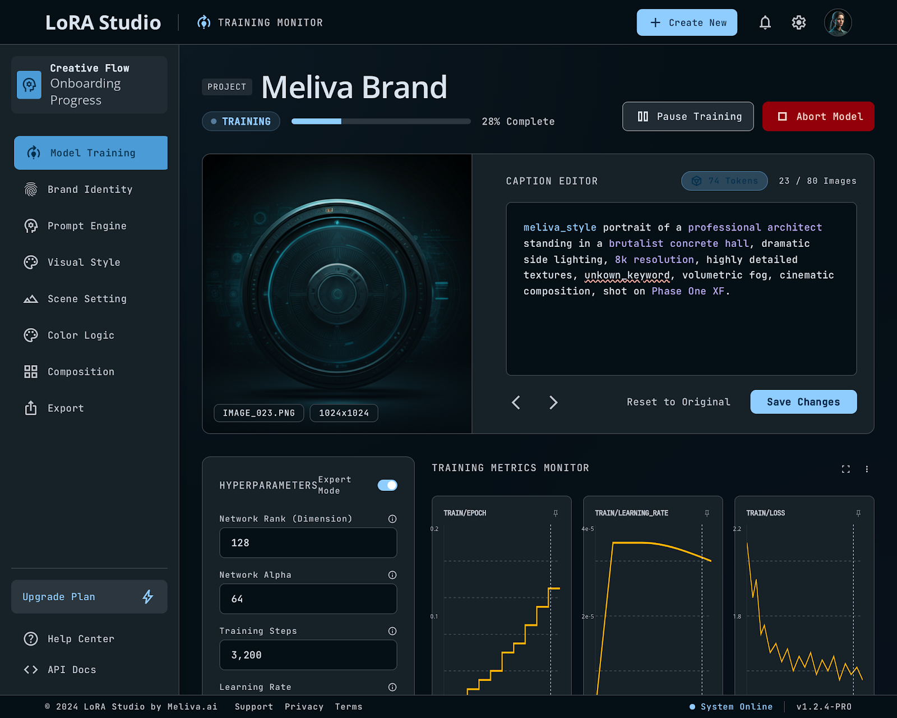
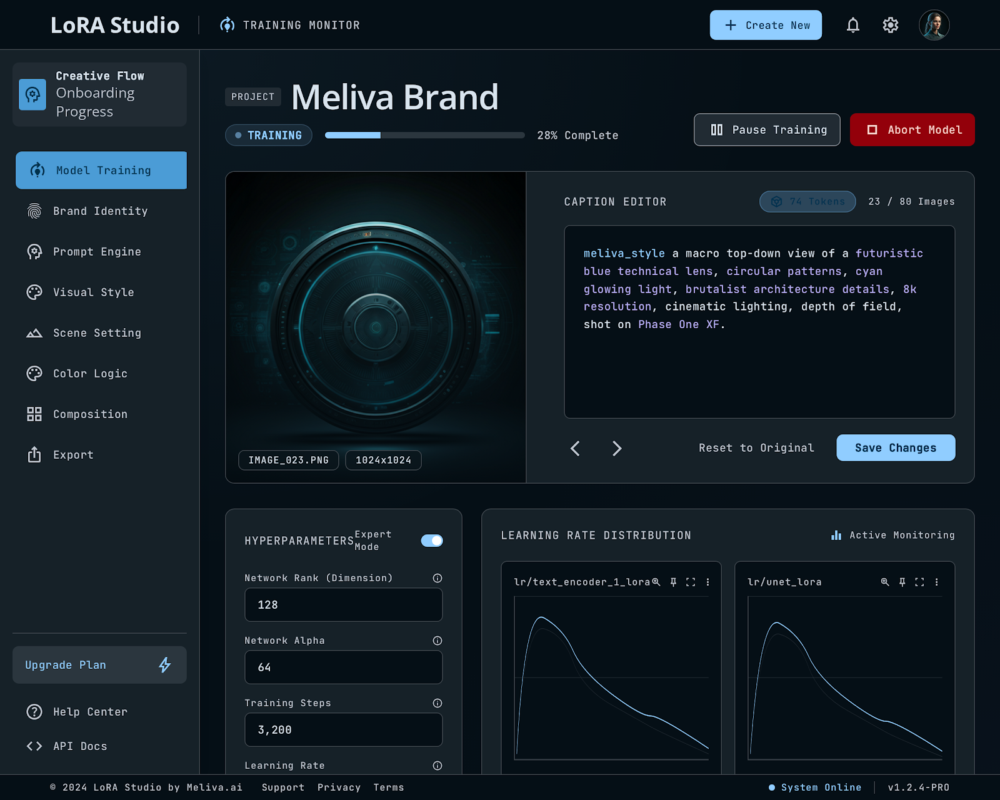

# DS Training Monitor — Caption Review, Training & Checkpoint Selection

This document walks through the Data Scientist's experience reviewing captions, monitoring training, and selecting the best checkpoint.

> **⚠️ Disclaimer:** The screenshots shown below are non-functional mockups. Original production interface screenshots have been replaced with mockups for client governance and privacy reasons.

## Dashboard (Landing)
- List of active projects with status cards
- Each card: Name | Type | Status | Images | Violations | Action button

## Caption Review (Inline Editor)

**Split view:**
- **Left:** Image (1024×1024 with zoom)
- **Right:** Caption editor with:
  - Syntax highlighting: trigger word in blue, class word in green
  - LOCKED violations in red with squiggles (IDE-style)
  - Token count in footer: "87 tokens (T5-XXL)"
  - Buttons: Save | Revert | Next ▶

**Sidebar:** Locked Attributes Card
- Trigger, class word, full list of terms that must NEVER appear

**Footer navigation:** ◀ 23/80 ▶ | 2 violations | 78 OK

**Real-time validation:** Every keystroke triggers `POST /captions/validate-single` (<200ms)

## Hyperparameter Override
Pre-filled with intelligent defaults. DS can adjust:

| Parameter | Default | Input | Info |
|---|---|---|---|
| Rank | 32 | Editable | "Expressive capacity of the model" |
| Alpha | 32 | Editable | "Learning rate modulator" |
| Steps | 3200 | Editable | "Calculated: 80 imgs × 40" |
| Learning Rate | 1e-4 | Editable | "Training speed" |
| Optimizer | adamw8bit | Dropdown | |
| EMA | ON | Toggle | "Learning smoothing" |

**Expert mode toggle** reveals: batch size, gradient accumulation, noise scheduler, dtype.

## Training Monitor (Real-Time)

**Loss curve chart** (WebSocket-updated):
- X-axis: Steps (0–3200)
- Y-axis: Loss (0.0–1.0)
- Red line: current loss
- Green band: ideal zone (0.20–0.40)
- Star markers: saved checkpoints

**Info bar:** Step: 1600/3200 | Loss: 0.32 | ETA: 45 min | GPU: 87%

**Sample previews:** Grid of 4 images generated every 250 steps

## Checkpoint Selection
- Grid comparing checkpoints (step, loss, 4 sample images each)
- Auto-recommendation: "We recommend step 2500 (loss 0.28). The last checkpoint (step 3200, loss 0.22) may be overfitting."
- Action: `POST /training-jobs/{id}/select-checkpoint`

---

**Key UX principle:** Full parameter control. Every hyperparameter is visible, editable, and explained.

*← Back to [README](../README.md)*
