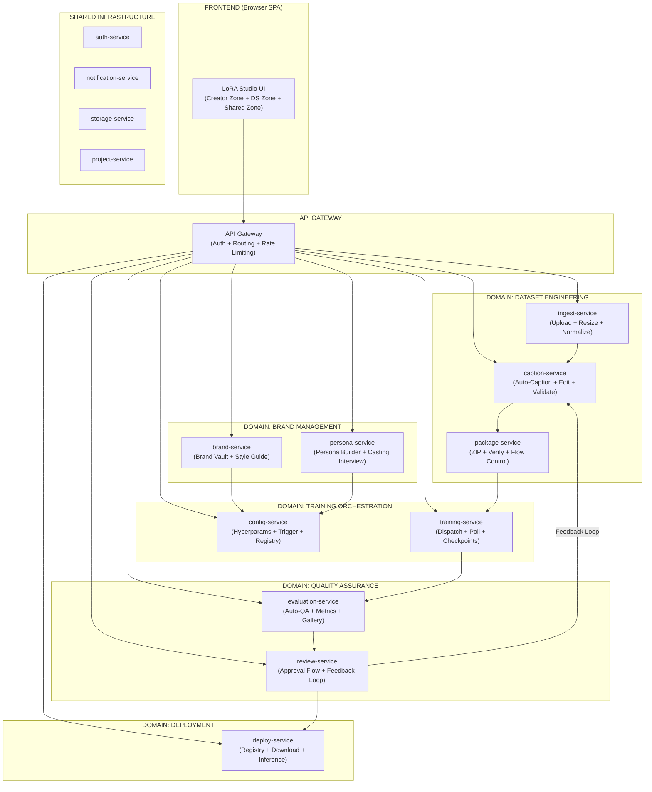
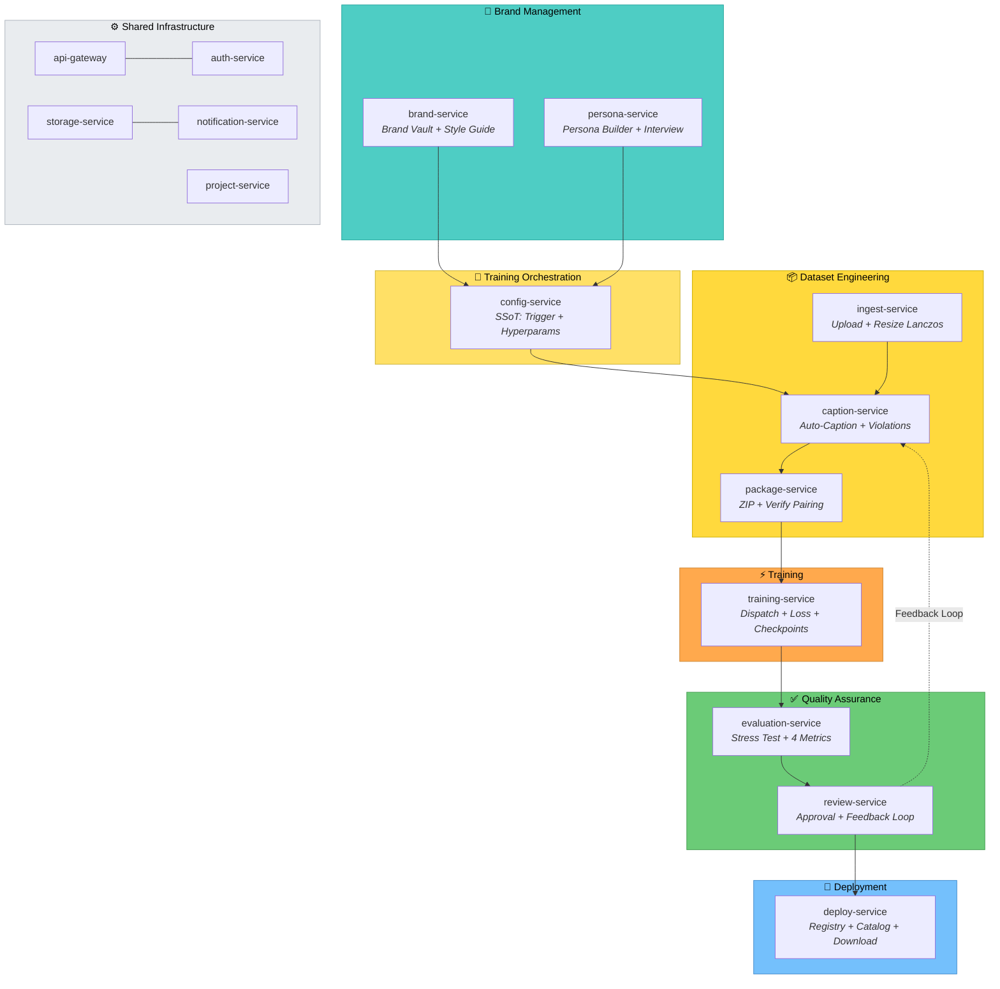

# 3. System Architecture — 15 Microservices (DDD)

## 3.1. Architecture Overview

## 3.2. Microservice Catalog

| # | Service | Domain | Responsibility | Pipeline Stage |
|---|---|---|---|---|
| 1 | **api-gateway** | Infra | Authentication, routing, rate limiting, API versioning | — |
| 2 | **auth-service** | Infra | Users, roles (Creator/DS/Admin), RBAC, JWT tokens | — |
| 3 | **storage-service** | Infra | Upload/download via presigned URLs, CDN, multipart | — |
| 4 | **notification-service** | Infra | Email, WebSocket real-time, role-differentiated messages | — |
| 5 | **project-service** | Infra | Timeline, status tracking, audit log | A–J |
| 6 | **brand-service** | Brand Mgmt | Brand Vault (brandbook, palette, logos), Style Guide wizard | A, C |
| 7 | **persona-service** | Brand Mgmt | Persona Builder, Casting Interview, Vision LLM auto-detect | A |
| 8 | **ingest-service** | Dataset Eng | Upload, quality validation (resolution, blur, MD5), Lanczos resize 1024² | D, E |
| 9 | **caption-service** | Dataset Eng | Auto-captioning via Vision LLM, inline editor, violation scanner (<200ms) | F |
| 10 | **package-service** | Dataset Eng | ZIP packaging, CRLF→LF conversion, image/caption pairing verification | F→G |
| 11 | **config-service** | Training | **SSoT** — LoRA Registry, trigger generation, hyperparameter calculation, tokenization validation | C, G |
| 12 | **training-service** | Training | Job dispatch (Replicate/local GPU), polling, loss monitoring, checkpoint management | H |
| 13 | **evaluation-service** | QA | Stress test generation, 4 automated metrics, result gallery | I |
| 14 | **review-service** | QA | Approval flow, creative→technical feedback translation, re-training trigger | I→J |
| 15 | **deploy-service** | Deploy | Safetensors publication, metadata JSON, model catalog, download | J |

## 3.3. Bounded Contexts (Domain-Driven Design)

**Communication rule:** Services in DIFFERENT domains communicate EXCLUSIVELY via REST API. Zero direct database access across domain boundaries.

## 3.4. Pipeline Backbone — 10 Automations + 3 Human Gates

The backbone is the orchestrated flow of REST calls between services, triggered by events:

| # | Automation | Service | Trigger Event | Output |
|---|---|---|---|---|
| 1 | Auto-Resize | ingest-service | `image.uploaded` | 1024×1024 Lanczos |
| 2 | Auto-Classify LOCKED/UNLOCKED | brand → config | `style_guide.saved` | Locked Attributes Card JSON |
| 3 | Auto-Generate Trigger | config-service | `lora_config.created` | 9-char a-z trigger (T5+CLIP validated) |
| 4 | Auto-Caption | caption-service | `dataset.ingested` | Paired .txt files via Vision LLM |
| 5 | Auto-Validate | caption-service | `captions.generated` | Violations report (word-boundary regex) |
| 6 | Auto-Config | config-service | `lora_config.created` | Calculated hyperparameters |
| 7 | Auto-Package | package-service | `captions.validated` | ZIP ready for training |
| 8 | Auto-Dispatch | training-service | `package.ready` | Training job dispatched |
| 9 | Auto-Poll | training-service | `training.started` | Status + loss + samples |
| 10 | Auto-QA | evaluation-service | `training.completed` | Score report |

**3 Human Gates:**

| Gate | Who Decides | What Happens | Mandatory? |
|---|---|---|---|
| **Gate 1: Caption Review** | Data Scientist | Reviews auto-generated captions, edits violations | Optional (auto-proceed after 24h) |
| **Gate 2: Hyperparameter Override** | Data Scientist | Adjusts rank, alpha, steps, LR before training | Optional (auto-proceed after 1h) |
| **Gate 3: Visual Approval** | Creator / Creative Director | Approves or rejects generated images | **MANDATORY** — no deployment without explicit approval |

## 3.5. Cloud Infrastructure Layer

The system runs on **NVIDIA GPUs** accessed via cloud provider compute instances. ComfyUI and Flux models are used in alignment with the **NVIDIA Inception** program. The architecture is designed to be cloud-agnostic.

### AWS as Canonical Reference (Production Implementation)

| Layer | AWS Service | Purpose |
|---|---|---|
| GPU Compute (Training) | EC2 G7E (RTX PRO 6000 96GB) / P5 (H100 80GB) | Fine-tuning LoRAs with full CUDA control |
| GPU Compute (Inference) | EC2 G5 (A10G 24GB) / Inf2 (Inferentia2) | Model serving and stress test generation |
| Container Orchestration | ECS Express Fargate | Microservice deployment (zero server management) |
| API Gateway | API Gateway + ALB | Routing, TLS termination, rate limiting |
| Object Storage | S3 | Brand assets, datasets, safetensors, ZIP packages |
| Secrets | Secrets Manager | API keys, JWT secrets, provider credentials |
| ML Platform | SageMaker | Alternative training dispatch (provider adapter) |
| Monitoring | CloudWatch | Logs, metrics, billing alerts |

### Cross-Provider Equivalence

| Layer | AWS (Canonical) | GCP (Equivalent) | Azure (Equivalent) |
|---|---|---|---|
| GPU Compute | EC2 G7E / P5 | Compute Engine A3 (H100) / A2 (A100) | NC A100 v4 / ND H100 v5 |
| Containers | ECS Express Fargate | Cloud Run | Container Apps |
| ML Platform | SageMaker | Vertex AI | Azure ML |
| Storage | S3 | Cloud Storage (GCS) | Blob Storage |
| Secrets | Secrets Manager | Secret Manager | Key Vault |
| Registry | ECR | Artifact Registry | ACR |
| Queues | SQS | Pub/Sub | Service Bus |
| IAM | IAM Roles + Instance Profiles | Service Accounts + Workload Identity | Managed Identities |

### NVIDIA Ecosystem Integration

| NVIDIA Component | Role in Pipeline |
|---|---|
| **H100 / A100 / RTX PRO 6000** | Training compute (≥24GB VRAM required for fine-tuning) |
| **CUDA 12.x + cuDNN + TensorRT** | Runtime acceleration stack |
| **NIM Microservices** | Alternative inference deployment (optimized containers) |
| **NGC Catalog** | Pre-optimized base model containers |
| **NVIDIA Inception** | Program validation for ComfyUI + Flux pipeline |
| **Triton Inference Server** | Alternative to BentoML for multi-framework model serving |

---

*Next: [04-EVALUATION.md](04-EVALUATION.md) — Automated metrics and business impact quantification.*
